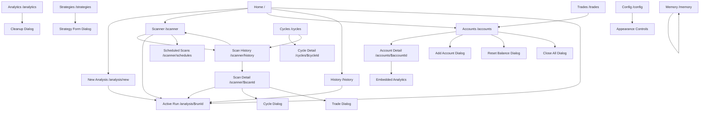

# TradingAgents Neumorphism Design System — Requirements

## Metadata

- **Feature**: TradingAgents Neumorphism Redesign
- **Document Type**: Requirements
- **Status**: Draft
- **Author**: Codex
- **Created**: 2026-05-21
- **Source Audit**:
  - `frontend/src/routes/route-tree.tsx`
  - `frontend/src/components/layout/*`
  - `frontend/src/components/ui/*`
  - Route containers under `frontend/src/components/{dashboard,analysis,scanner,accounts,analytics,strategies,cycles,config,trades}`

---

## 1. Objective

Design a complete TradingAgents design system that matches an exact neumorphism visual language before any broad page rewrite begins.

This phase does **not** require migrating every page immediately. It must produce a system-level contract that defines:

- the target visual language,
- the shared shell and navigation behavior,
- the page templates,
- the reusable component inventory,
- the required component props and states,
- the route-to-component connection map,
- the implementation and rollout constraints.

The end result of this phase is a design system specification that can drive a controlled rewrite of the existing app without rediscovering structure during implementation.

---

## 2. Discovery Summary

### 2.1 Current Product Surface

The current frontend is a React 19 + Vite + TanStack Router app with a persistent application shell and 17 user-facing routes:

- `/`
- `/analysis/new`
- `/analysis/$runId`
- `/history`
- `/scanner`
- `/scanner/history`
- `/scanner/schedules`
- `/scanner/$scanId`
- `/accounts`
- `/accounts/$accountId`
- `/analytics`
- `/strategies`
- `/cycles`
- `/cycles/$cycleId`
- `/config`
- `/memory`
- `/trades`

### 2.2 Current Shell Model

The app already has a strong shell pattern:

- persistent left sidebar on desktop,
- sticky top header,
- market/runtime ticker strip,
- mobile dock,
- command palette,
- appearance controls,
- route-local page content under a shared `RootLayout`.

### 2.3 Current Visual Language To Replace

The current styling is not neumorphic. It is a glassmorphism and gradient-heavy system built around:

- translucent cards,
- blurred surfaces,
- colorful ambient washes,
- luminous hero backgrounds,
- gradient action buttons,
- mixed glow and glass effects.

The redesign must replace that with an exact soft-surface neumorphism system.

### 2.4 Route Containers Already Audited

The following page containers define the current information architecture and must remain the functional source of truth during redesign:

- `HomeDashboard`
- `ConfigForm`
- `AnalysisDashboard`
- `HistoryList`
- `ScannerPage`
- `ScanHistoryPage`
- `ScheduledScansPage`
- `ScanDetailPage`
- `AccountsDashboard`
- `AccountDetailView`
- `AnalyticsDashboard`
- `StrategiesPage`
- `CycleListPage`
- `CycleDetailPage`
- `ConfigPage`
- `MemoryPage`
- `TradesPage`

---

## 3. Scope

### 3.1 In Scope

- full neumorphism foundation for light and dark themes,
- design tokens,
- surface and depth rules,
- component catalog,
- component props,
- page template definitions,
- route-to-template mapping,
- responsive shell behavior,
- design-system acceptance criteria,
- recommendation on third-party neumorphism library adoption,
- migration sequencing.

### 3.2 Out of Scope

- backend API changes,
- route additions unless required by UX cleanup,
- feature removal,
- data model changes,
- immediate rewrite of every feature component,
- branding/logo redesign outside the system needs.

---

## 4. Design North Star

### 4.1 Required Style Characteristics

The redesign must match a true neumorphism aesthetic, not a generic modern dashboard.

Required characteristics:

- one dominant parent surface per theme,
- child surfaces that appear extruded from that parent surface,
- dual shadow logic: soft highlight plus soft shadow,
- strong use of raised and inset states,
- rounded geometry with large radii,
- low-gloss matte finish,
- restrained color usage with accent reserved for status and interaction,
- tactile controls that visually press into or lift from the surface.

### 4.2 Style Prohibitions

The design system must avoid the following except in narrowly justified cases:

- glass blur as a primary surface treatment,
- frosted transparency as the default panel style,
- saturated multi-hue gradients on large panels,
- hard borders as the main way to separate layers,
- flat shadcn defaults,
- neon-like glow as a primary interaction signal,
- overly glossy skeuomorphic highlights.

### 4.3 Core Experience Principles

1. **Soft Depth**  
Every interactive element must communicate whether it is raised, pressed, neutral, or disabled through depth rather than only color.

2. **Single Material Illusion**  
The app should feel like one carved material system with multiple depths, not separate floating cards pasted on a background.

3. **Data-Dense Without Breaking Style**  
Trading tables, charts, and status-heavy panels must stay usable while preserving the neumorphic language.

4. **Consistent Touch Feedback**  
Buttons, segmented controls, tabs, chips, toggles, and dock items must all use the same press-depth behavior.

5. **Accessible Soft UI**  
The design must remain readable under high density, negative/positive PnL states, and long operational sessions.

---

## 5. Functional Design Requirements

### 5.1 Global Requirements

- FR-001: The app shall use a neumorphic token system that supports both light and dark modes.
- FR-002: The shell, page headers, cards, forms, dialogs, tables, tabs, and mobile dock shall all share the same depth model.
- FR-003: The redesign shall preserve all existing routes and their functional entry points.
- FR-004: The redesign shall define shared page templates so detail pages stop diverging visually from shell-driven pages.
- FR-005: The redesign shall normalize current exceptions where detail pages bypass the shared `PageHeader` pattern.
- FR-006: The redesign shall provide a migration-ready component API so feature teams can swap primitives incrementally.
- FR-007: The redesign shall preserve the current navigation grouping: Overview, Research, Portfolio, System.
- FR-008: The redesign shall preserve command palette access, appearance controls, market/runtime strip, and mobile dock behavior.

### 5.2 Non-Functional Requirements

- NFR-001: The design system shall work across desktop, tablet, and mobile breakpoints without route-specific one-offs.
- NFR-002: The design system shall allow high-contrast operation without abandoning the neumorphic identity.
- NFR-003: The design system shall remain compatible with the existing Base UI + Tailwind architecture.
- NFR-004: The design system shall avoid introducing styling dependencies that fight the current headless primitive stack.
- NFR-005: The design system shall be token-first so theme, shadows, and accent palettes can be tuned centrally.

---

## 6. Information Architecture And Navigation

### 6.1 Route Inventory

| Route | Nav Section | Current Container | Primary Purpose | Primary Connected Routes |
| --- | --- | --- | --- | --- |
| `/` | Overview | `HomeDashboard` | App command center | `/analysis/new`, `/scanner`, `/accounts`, `/history`, `/analysis/$runId` |
| `/analysis/new` | Research | `ConfigForm` | Launch new analysis | `/analysis/$runId` |
| `/analysis/$runId` | Research | `AnalysisDashboard` | Live run console | Back to prior route |
| `/history` | Research | `HistoryList` | Browse saved analyses | `/analysis/$runId`, `/analysis/new` |
| `/scanner` | Research | `ScannerPage` | Run market scans | `/scanner/history`, `/analysis/$runId` |
| `/scanner/history` | Research | `ScanHistoryPage` | Browse scans | `/scanner`, `/scanner/$scanId` |
| `/scanner/schedules` | Research | `ScheduledScansPage` | Manage recurring scans | Schedule create/edit dialogs |
| `/scanner/$scanId` | Research | `ScanDetailPage` | Inspect scan results | `/scanner/history`, `/analysis/$runId`, cycle dialog, trade dialog |
| `/accounts` | Portfolio | `AccountsDashboard` | Portfolio account command center | `/accounts/$accountId`, add/reset/close dialogs |
| `/accounts/$accountId` | Portfolio | `AccountDetailView` | Single account detail | `/accounts`, embedded analytics |
| `/analytics` | Portfolio | `AnalyticsDashboard` | Portfolio performance analytics | Cleanup dialog |
| `/trades` | Portfolio | `TradesPage` | Live and historical trades | `/accounts` when no account exists |
| `/strategies` | Portfolio | `StrategiesPage` | Strategy library | Strategy form dialog, import/export |
| `/cycles` | Portfolio | `CycleListPage` | Trading cycle listing | `/cycles/$cycleId`, `/scanner/history` |
| `/cycles/$cycleId` | Portfolio | `CycleDetailPage` | Trading cycle detail | `/cycles` |
| `/config` | System | `ConfigPage` | Runtime config and appearance | Appearance controls |
| `/memory` | System | `MemoryPage` | Memory log browser | Pagination only |

### 6.2 Navigation Graph

### 6.3 Shell Requirements

- The desktop shell shall keep a persistent left navigation slab.
- The top bar shall remain sticky.
- The market/runtime strip shall remain visible on every primary route.
- The mobile experience shall use a bottom dock plus a slide-out full navigation panel.
- The command palette shall remain global and route-aware.
- Route changes shall not visually break the illusion of one continuous material surface.

---

## 7. Visual Foundation Requirements

### 7.1 Theme Model

The design system shall support exactly two first-class surface modes:

- **Ivory**: bright, low-chroma, warm-neutral raised surfaces.
- **Graphite**: dark, low-chroma, cool-neutral raised surfaces.

Additional palettes may exist, but they must behave as accent families, not as completely different ambient art directions.

### 7.2 Color Rules

- Base surfaces shall use tightly related tonal values.
- Accent colors shall not dominate the background.
- Positive, warning, and destructive states shall remain recognizable inside soft UI constraints.
- Chart colors shall be tuned to remain legible against low-contrast surfaces.

### 7.3 Depth States

Every system component must support one or more of the following depth states:

- `raised`
- `inset`
- `flat`
- `floating-accent`
- `disabled-muted`

### 7.4 Shadow Tokens

The token system shall define:

- outer highlight shadow,
- outer occlusion shadow,
- inset highlight shadow,
- inset occlusion shadow,
- focus ring,
- active accent halo,
- disabled soft edge.

### 7.5 Shape Rules

- large radius surfaces: 24-32px,
- medium radius controls: 16-24px,
- small chip/toggle radii: 999px for pills or 12-16px for rounded rectangles,
- no sharp corners in primary shell or component surfaces.

### 7.6 Typography

- The system shall replace the current utilitarian glass dashboard typography with a more tactile editorial hierarchy.
- Headings shall feel calm and confident, not futuristic or neon.
- Numeric data shall keep tabular behavior.
- Monospace remains allowed only for IDs, model names, symbols, and dense numeric tables.

### 7.7 Motion

- Press interactions shall visually transition from raised to inset or compressed states.
- Hover shall be subtle and depth-based, not float-based by default.
- Large ambient shimmer, blur shimmer, and gradient drift are not allowed as primary motion language.
- Most transitions shall complete in 120-180ms.

### 7.8 Background System

The app background shall become a restrained material field rather than a glassy atmospheric scene.

Required rules:

- one primary background plate,
- optional very subtle directional light falloff,
- optional noise or grain at low opacity,
- no dominant radial spotlight art behind every page.

---

## 8. Layout And Template Requirements

### 8.1 Required Page Templates

| Template | Purpose | Used By |
| --- | --- | --- |
| `NeuOverviewTemplate` | hero + action cards + live activity | `/` |
| `NeuWizardTemplate` | multi-step form workbench with sticky step rail | `/analysis/new` |
| `NeuConsoleTemplate` | streaming dashboard with stats, status, messages, reports | `/analysis/$runId` |
| `NeuArchiveTemplate` | filters + results grid/list + bulk actions | `/history`, `/scanner/history` |
| `NeuWorkbenchTemplate` | parameter form + live results + secondary actions | `/scanner`, `/scanner/schedules` |
| `NeuPortfolioGridTemplate` | hero + filters + account cards | `/accounts` |
| `NeuEntityDetailTemplate` | shared detail layout with header, summary, tabs or sections | `/accounts/$accountId`, `/scanner/$scanId`, `/cycles/$cycleId` |
| `NeuAnalyticsTemplate` | controls + charts + KPI rail + cleanup actions | `/analytics` |
| `NeuLibraryTemplate` | filters + searchable cards + CRUD dialogs | `/strategies` |
| `NeuTableIndexTemplate` | hero + responsive table/list + pagination | `/cycles`, `/trades`, `/memory`, `/config` |
| `NeuInspectorTemplate` | split inspector layout for operational settings and system state | `/config` |

### 8.2 Shared Layout Rules

- Every route shall begin with one shared header pattern, even detail routes.
- Detail pages that currently use ad hoc back buttons and headings shall migrate to `NeuEntityHeader`.
- Tables shall sit inside inset wells within raised parent panels.
- Charts shall sit inside inset plot wells with softer axes and restrained grid lines.
- Dialogs shall use raised outer shells with inset content zones where form density is high.

---

## 9. Component Requirements

## 9.1 Foundation Surfaces

| Component | Purpose | Required Props | Required States / Variants |
| --- | --- | --- | --- |
| `NeuSurface` | Base depth primitive for all containers | `depth`, `tone`, `radius`, `padding`, `interactive`, `asChild`, `className` | `raised`, `inset`, `flat`, `accent`, `disabled` |
| `NeuPanel` | Standard content container | `title`, `description`, `actions`, `footer`, `depth`, `dense` | default, dense, scrollable, empty, loading |
| `NeuWell` | Inset content region inside a raised parent | `padding`, `scrollable`, `minHeight` | inset, focused, disabled |
| `NeuDivider` | Low-emphasis separator | `orientation`, `decorative`, `inset` | horizontal, vertical |
| `NeuGlowAccent` | Controlled accent highlight only where needed | `tone`, `size`, `subtle` | primary, success, warning, danger |

## 9.2 Shell And Navigation

| Component | Purpose | Required Props | Required States / Variants |
| --- | --- | --- | --- |
| `NeuAppShell` | Global page frame | `sidebar`, `topbar`, `dock`, `children` | desktop, tablet, mobile |
| `NeuSidebar` | Primary nav slab | `sections`, `activePath`, `onNavigate`, `collapsed` | expanded, compact, mobile-sheet |
| `NeuNavItem` | Sidebar item | `icon`, `label`, `description`, `active`, `badge`, `href` | idle, active, hovered, pressed |
| `NeuTopbar` | Sticky route header | `section`, `title`, `description`, `actions`, `statusPill` | desktop, condensed |
| `NeuMarketStrip` | Runtime and portfolio ticker strip | `items`, `compact`, `scrollable` | success, warning, danger, neutral |
| `NeuMobileDock` | Bottom mobile nav | `items`, `activePath`, `onMore` | active, inactive |
| `NeuCommandPalette` | Global route/action switcher | `open`, `query`, `groups`, `onSelect`, `onOpenChange` | empty, loading, filtered |
| `NeuAppearanceStudio` | Theme controls surface | `theme`, `palette`, `contrast`, `onThemeChange`, `onPaletteChange`, `onContrastChange`, `compact` | full, compact |

## 9.3 Header And Hero Components

| Component | Purpose | Required Props | Required States / Variants |
| --- | --- | --- | --- |
| `NeuPageHeader` | Primary page intro surface | `eyebrow`, `title`, `description`, `actions`, `stats`, `meta`, `children`, `variant` | overview, standard, dense |
| `NeuEntityHeader` | Detail page header with back path | `title`, `subtitle`, `backTo`, `status`, `actions`, `stats` | detail, critical, archived |
| `NeuStatCapsule` | Header or panel metric pill | `label`, `value`, `tone`, `trend`, `icon`, `delta` | accent, success, warning, danger, neutral |
| `NeuStatusPill` | Compact operational state | `label`, `tone`, `icon`, `animated` | live, syncing, replay, paused, failed |

## 9.4 Inputs And Form Controls

| Component | Purpose | Required Props | Required States / Variants |
| --- | --- | --- | --- |
| `NeuButton` | Action button | `variant`, `size`, `icon`, `iconPosition`, `loading`, `disabled`, `pressed`, `asChild` | primary, secondary, ghost, danger, soft-tonal |
| `NeuIconButton` | Icon-only control | `icon`, `label`, `size`, `tone`, `disabled` | raised, inset, ghost |
| `NeuInput` | Text input | `label`, `value`, `onChange`, `placeholder`, `leadingIcon`, `trailing`, `helperText`, `error`, `disabled`, `required` | default, error, success, disabled |
| `NeuTextArea` | Multi-line input | `label`, `value`, `onChange`, `rows`, `helperText`, `error` | default, error, disabled |
| `NeuSelect` | Single-select dropdown | `label`, `options`, `value`, `onChange`, `placeholder`, `searchable`, `renderOption`, `error`, `disabled` | default, searchable, grouped |
| `NeuMultiSelect` | Multi-select / analyst picker | `label`, `options`, `value`, `onChange`, `maxVisibleTags`, `helperText` | compact, searchable, chip-list |
| `NeuCombobox` | Searchable string input | `label`, `options`, `value`, `onChange`, `loading`, `disabled`, `allowCustom` | loading, no-results, disabled |
| `NeuToggleGroup` | Segmented mode switcher | `label`, `options`, `value`, `onChange`, `size` | single, multi |
| `NeuTabs` | Section switching inside a page | `value`, `onValueChange`, `items`, `orientation`, `variant` | pill, line, inset |
| `NeuCheckbox` | Boolean selection | `label`, `checked`, `onCheckedChange`, `description`, `disabled` | checked, unchecked, indeterminate |
| `NeuRadioGroup` | Exclusive options | `label`, `options`, `value`, `onChange`, `orientation` | horizontal, vertical |
| `NeuSlider` | Numeric range control | `label`, `value`, `min`, `max`, `step`, `onValueChange`, `marks` | single, range |
| `NeuDateField` | Date selection | `label`, `value`, `onChange`, `min`, `max`, `error` | default, invalid |
| `NeuModelPicker` | Specialized model selector | `label`, `provider`, `options`, `value`, `onChange`, `remote`, `loading`, `error`, `recents` | local, remote, fallback |
| `NeuAccountPicker` | Specialized account selector | `accounts`, `selectedAccount`, `onSelect`, `onToggleInclusion`, `searchable` | portfolio, single account, excluded |

## 9.5 Data Display And Utility Components

| Component | Purpose | Required Props | Required States / Variants |
| --- | --- | --- | --- |
| `NeuCard` | Generic raised content card | `title`, `description`, `actions`, `footer`, `size`, `interactive` | default, compact, clickable |
| `NeuBadge` | Label chip | `variant`, `tone`, `icon`, `children` | solid, soft, outline, ghost |
| `NeuTable` | Dense tabular display | `columns`, `rows`, `rowKey`, `toolbar`, `loading`, `emptyState`, `rowActions`, `stickyHeader` | dense, compact, stacked-mobile |
| `NeuFilterBar` | Filter row container | `filters`, `search`, `actions`, `clearAll` | sticky, collapsible, compact |
| `NeuEmptyState` | Standard empty surface | `icon`, `title`, `description`, `primaryAction`, `secondaryAction` | centered, inline |
| `NeuSkeleton` | Loading placeholder | `shape`, `lines`, `height`, `width` | text, card, chart, table |
| `NeuPagination` | Page controls | `page`, `pageSize`, `total`, `onPageChange`, `onPageSizeChange` | compact, full |
| `NeuKpiGrid` | Metric card cluster | `items`, `columns`, `dense` | 2-up, 4-up, responsive |
| `NeuTickerMetric` | Market strip item | `icon`, `label`, `value`, `detail`, `tone` | positive, warning, danger, accent |
| `NeuScoreBar` | Signal score display | `score`, `scale`, `direction` | buy, sell, neutral |
| `NeuProgressTrack` | Progress bar or scanner track | `value`, `max`, `tone`, `indeterminate`, `segmented` | standard, live, danger |

## 9.6 Charts And Analytics

| Component | Purpose | Required Props | Required States / Variants |
| --- | --- | --- | --- |
| `NeuChartCard` | Chart container | `title`, `description`, `toolbar`, `legend`, `footer`, `loading`, `emptyState` | line, area, bar, mixed |
| `NeuChartToolbar` | Period/scope controls | `period`, `scope`, `actions`, `onPeriodChange`, `onScopeChange` | inline, wrapped |
| `NeuLegendChip` | Chart legend item | `label`, `color`, `active`, `onToggle` | active, muted |

## 9.7 Overlays And Feedback

| Component | Purpose | Required Props | Required States / Variants |
| --- | --- | --- | --- |
| `NeuDialog` | Standard modal | `open`, `onOpenChange`, `title`, `description`, `size`, `footer`, `danger`, `initialFocus` | default, confirm, danger, full-screen-mobile |
| `NeuDrawer` | Mobile-first slide panel | `open`, `onOpenChange`, `title`, `description`, `side` | left, right, bottom |
| `NeuToast` | Short notification | `title`, `description`, `tone`, `action` | success, warning, danger, neutral |
| `NeuBanner` | Inline status banner | `tone`, `title`, `description`, `actions` | info, warning, error, success |
| `NeuReconnectionChip` | Connection/replay indicator | `status`, `attempt`, `onRetry` | connected, reconnecting, offline |
| `NeuConfirmDialog` | High-risk confirmation | `open`, `onConfirm`, `onCancel`, `title`, `body`, `confirmTone`, `confirmLabel` | destructive, caution |

## 9.8 Trading-Specific Composite Components

| Component | Purpose | Required Props | Required States / Variants |
| --- | --- | --- | --- |
| `AnalysisLaunchWizard` | Analysis form shell | `initialValues`, `providers`, `models`, `symbols`, `watchlists`, `onSubmit`, `onSaveDraft` | 3-step, error, submitting |
| `AnalysisRunConsole` | Live analysis page | `run`, `agents`, `messages`, `reports`, `stats`, `wsState`, `configSummary` | live, replay, terminal, failed |
| `ScanWorkbench` | Scanner route core | `settings`, `activeScan`, `results`, `filters`, `onStart`, `onCancel`, `onTrade`, `onSchedule` | idle, running, completed, lost-scan |
| `ScanResultsBoard` | Grouped scanner results | `buy`, `sell`, `hold`, `filters`, `onTrade`, `onViewAnalysis` | grouped, filtered, compact |
| `AccountsGrid` | Portfolio account grid | `accounts`, `filter`, `onFilterChange`, `onAdd`, `onResetDemo`, `onCloseAll` | all, live, demo, empty |
| `AccountSummaryHero` | Single account summary | `account`, `wallet`, `pnl`, `actions` | live, demo, loading, error |
| `TradeDeskWorkspace` | Trades page composite | `activeTrades`, `historyTrades`, `filters`, `stats`, `wsConnected`, `onCloseTrade`, `onCloseAll` | active, history, disconnected |
| `StrategyLibraryBoard` | Strategy grid/list | `strategies`, `filters`, `search`, `onCreate`, `onEdit`, `onDuplicate`, `onDelete`, `onImport`, `onExport` | loading, empty, filtered |
| `CycleBoard` | Cycle list/detail system | `cycles`, `selectedCycle`, `onStop`, `onRefresh` | active, completed, failed |
| `ConfigInspector` | Resolved config and overrides | `resolved`, `overrides`, `maskedKeys`, `appearance` | loading, error, default |
| `MemoryRecordList` | Memory browser | `items`, `page`, `total`, `onPageChange` | empty, loading, paginated |

---

## 10. Current To Target Component Mapping

| Current Component | Target System Component | Notes |
| --- | --- | --- |
| `PageHeader` | `NeuPageHeader` / `NeuEntityHeader` | broaden props to support breadcrumbs, detail routes, meta rail |
| `Card` | `NeuCard` / `NeuPanel` / `NeuWell` | split by semantic depth role instead of one generic card |
| `Button` | `NeuButton` / `NeuIconButton` | unify tactile depth across all controls |
| `Input` | `NeuInput` | shift from flat field to inset field |
| `Select` | `NeuSelect` | retain headless primitive, replace popup and trigger styling |
| `Tabs` | `NeuToggleGroup` + `NeuTabs` | share pressed/raised segmented behavior |
| `Dialog` | `NeuDialog` | move all ad hoc modals to one raised modal shell |
| `AppMarketBar` | `NeuMarketStrip` | keep function, replace look |
| `AppCommandPalette` | `NeuCommandPalette` | keep behavior, match new surface system |
| `AppearanceControls` | `NeuAppearanceStudio` | reduce palette sprawl, make theme controls neumorphic |
| `MobileDock` | `NeuMobileDock` | preserve route shortcuts with pressed-state items |
| `AccountSelector` | `NeuAccountPicker` | standardize as a reusable picker |
| `ModelSelect` | `NeuModelPicker` | convert to design-system specialized control |

---

## 11. Route-Specific Requirements

## 11.1 Overview

### `/`

- Must use `NeuOverviewTemplate`.
- Must keep hero summary plus two primary CTAs: analysis and scanner.
- Must keep feature cards for Research, Scanner, and Portfolio.
- Must keep active analysis queue cards.
- Empty state must remain one-click actionable.

Required composites:

- `NeuPageHeader`
- `NeuCard`
- `NeuKpiGrid`
- `NeuEmptyState`

## 11.2 Research

### `/analysis/new`

- Must become a full neumorphic wizard surface with clear step progression.
- Must preserve:
  - asset type toggle,
  - ticker/symbol entry,
  - provider and model selection,
  - analyst selection,
  - workflow mode,
  - backend endpoint selection,
  - data vendor settings,
  - watchlist integration,
  - agent model overrides.
- The current collapsible advanced sections must be normalized under one `NeuWizardTemplate`.

### `/analysis/$runId`

- Must use `NeuConsoleTemplate`.
- Must keep:
  - header stats,
  - connection state,
  - config summary,
  - live progress banner,
  - stats bar,
  - agent status table,
  - message panel,
  - report panel.
- Header and action rail must feel like tactile command hardware, not glass hero art.

### `/history`

- Must use `NeuArchiveTemplate`.
- Must preserve advanced filters, search, sorting, score-aware metadata, delete/cancel actions, and pagination.
- Rows/cards must make signal confidence and action direction readable without abandoning the soft UI style.

### `/scanner`

- Must use `NeuWorkbenchTemplate`.
- Must preserve:
  - scan configuration controls,
  - workflow toggle,
  - provider/model settings,
  - analyst selection,
  - concurrency settings,
  - auto trade configuration,
  - active scan state,
  - result filters,
  - grouped or tabled scan results,
  - deep link to analysis runs,
  - trade dialog entry.

### `/scanner/history`

- Must use `NeuArchiveTemplate`.
- Must preserve scan cards, delete preview confirmation, running state, and fast link back to new scan.

### `/scanner/schedules`

- Must use `NeuWorkbenchTemplate` for the index page and `NeuDialog` for schedule create/edit.
- Must preserve schedule type selection, timing config, scan config cloning, auto trade settings, and action controls.

### `/scanner/$scanId`

- Must migrate to `NeuEntityDetailTemplate`.
- Must preserve:
  - back navigation,
  - scan summary,
  - running progress,
  - grouped result sections,
  - result table,
  - analysis links,
  - trade dialog,
  - cycle creation dialog,
  - delete and cancel actions.

## 11.3 Portfolio

### `/accounts`

- Must use `NeuPortfolioGridTemplate`.
- Must preserve:
  - aggregate stats,
  - filter chips for all/demo/live,
  - account cards,
  - add account,
  - reset demo balance,
  - close all positions,
  - loading and empty states.

### `/accounts/$accountId`

- Must migrate to `NeuEntityDetailTemplate`.
- Must no longer rely on ad hoc raw buttons and custom dialogs that ignore the shared header system.
- Must preserve:
  - wallet summary,
  - KPI row,
  - positions,
  - orders,
  - PnL summary,
  - embedded analytics tab,
  - rotate credentials flow,
  - delete account flow.

### `/analytics`

- Must use `NeuAnalyticsTemplate`.
- Must preserve:
  - account type toggle,
  - account selector,
  - period selector,
  - snapshot action,
  - cleanup action,
  - KPI cards,
  - equity curve,
  - drawdown,
  - daily PnL,
  - monthly grid.

### `/trades`

- Must use `NeuTableIndexTemplate` plus `TradeDeskWorkspace`.
- Must preserve:
  - live/history tabs,
  - trade stats,
  - filters,
  - close trade modal,
  - close all confirmation,
  - detail side panel,
  - WebSocket disconnect banner.

### `/strategies`

- Must use `NeuLibraryTemplate`.
- Must preserve:
  - search,
  - category filter,
  - status filter,
  - import/export,
  - create/edit/duplicate/delete actions,
  - strategy cards,
  - strategy form dialog.

### `/cycles`

- Must use `NeuTableIndexTemplate`.
- Must preserve card layout on mobile, table layout on larger screens, active auto-refresh, and pagination.

### `/cycles/$cycleId`

- Must migrate to `NeuEntityDetailTemplate`.
- Must preserve:
  - summary hero,
  - configuration metrics,
  - execution status metrics,
  - trade table,
  - stop cycle confirmation.

## 11.4 System

### `/config`

- Must use `NeuTableIndexTemplate` or `NeuInspectorTemplate`.
- Must preserve appearance controls, resolved config table, active overrides, and connectivity notes.

### `/memory`

- Must use `NeuTableIndexTemplate`.
- Must preserve decision records, confidence/status pills, and pagination.

---

## 12. Library Evaluation Requirements

### 12.1 Evaluation Criteria

Any third-party neumorphism library must be judged against:

- compatibility with React + current headless primitives,
- compatibility with Tailwind-based token styling,
- ability to support custom trading-specific composites,
- dark mode quality,
- accessibility flexibility,
- dependency overhead,
- long-term maintainability.

### 12.2 Candidate Assessment

| Candidate | Fit | Notes |
| --- | --- | --- |
| `@carton-org/react-neumorphism` | Medium-Low | Dedicated React neumorphism component library, but it introduces its own component layer and Emotion + Motion peers. Good reference, weak fit as the core system. |
| `neumo-ui` | Low | CSS toolkit with themes and light/dark direction, but not aligned with the app's headless React component architecture. |
| `ui-aesthetic-utils` | Low | Multi-effect utility package spanning glass, glow, and neumorphism. Too broad and not tailored to this app's architecture or exact style target. |
| Keep current Base UI stack and build custom neumorphic wrappers | High | Best match for route complexity, accessibility needs, and incremental migration strategy. |

### 12.3 Recommendation

The project should **not** adopt a third-party neumorphism library as the primary component system.

Instead:

- keep Base UI primitives,
- build a dedicated TradingAgents neumorphic token layer,
- build app-specific `Neu*` wrappers and templates,
- optionally use third-party neumorphism libraries only as visual reference during prototyping.

---

## 13. Accessibility Requirements

- A high-contrast mode must remain available.
- Text, badges, KPIs, charts, form labels, placeholders, and table content must meet contrast expectations for operational use.
- Inset fields must not rely on shadow alone to communicate focus.
- Destructive, success, and warning states must remain distinguishable without depending only on color.
- Dense tables must support keyboard navigation and visible focus.
- Soft shadows must never be the only boundary signal around interactive controls.

---

## 14. Implementation Deliverables

Phase 1 deliverables:

- token map,
- neumorphic CSS utilities,
- component naming and prop contracts,
- page templates,
- shell redesign spec,
- migration matrix.

Phase 2 deliverables:

- `NeuSurface`, `NeuCard`, `NeuButton`, `NeuInput`, `NeuSelect`, `NeuDialog`, `NeuTabs`,
- `NeuPageHeader`, `NeuEntityHeader`, `NeuMarketStrip`, `NeuSidebar`, `NeuMobileDock`, `NeuCommandPalette`.

Phase 3 deliverables:

- route template integration,
- detail page normalization,
- feature-composite migration starting with shell and shared primitives.

---

## 15. Acceptance Criteria

The design system requirements are satisfied when all of the following are true:

- every current route is mapped to a target page template,
- every major feature page has a documented section hierarchy,
- the shell behavior is fully specified for desktop and mobile,
- the component catalog covers shell, inputs, display, overlays, and trading-specific composites,
- each required design-system component has an explicit prop contract,
- the visual language is clearly neumorphic rather than glassmorphic,
- the library recommendation is explicit and implementation-ready,
- the document is sufficient to start component implementation without re-auditing route structure.

---

## 16. Immediate Build Order

Recommended implementation order after this document is approved:

1. `NeuSurface`, token system, and theme variables.
2. `NeuButton`, `NeuInput`, `NeuSelect`, `NeuTabs`, `NeuDialog`, `NeuBadge`.
3. Shell components: sidebar, topbar, market strip, mobile dock, command palette.
4. `NeuPageHeader` and `NeuEntityHeader`.
5. Page templates.
6. Shared feature composites.
7. Route-by-route migration, starting with Home, Config, Memory, then Analysis and Scanner, then Portfolio surfaces.
